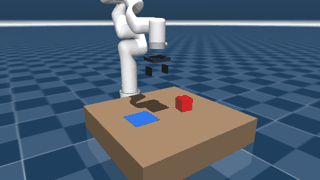

# jev-arm-lab — 机械臂任务级决策实验台

> **结论先看这里：[docs/FINDINGS.md](docs/FINDINGS.md)**（全部数字、失败地图、局限、复现方式）
> 一句话：把"下一步干什么"交给一个只做判断的模型（Jev），代码保留否决权 —— 20/20 场景完成、
> 抓稳判断 79 个样本全对（Brier 0.030）、危险误判 0 次；而测量口径错了的话，同一个模型会被评成 77%。



用 MuJoCo 里的 xArm7 做"抓取方块放进目标区"，把**每一步该用哪个技能**交给一个类型化判断模型
（TypeSafe 的 Jev，或本地规则替身）来定。目的是验证一件事：

> 判断（该不该动、抓稳没有、任务到哪一步了）交给模型，流程、几何和安全否决权留在代码里 —— 这条分工在机械臂上到底成不成立。

答案是**成立，但阈值必须自己标定**。实测数据见下面的"实测结果"。

## 快速开始

```powershell
cd D:\AI\jev-arm-lab

# 1) 规则替身，不需要 API key，先看整条循环
.\.venv\Scripts\python.exe -m jev_arm.main --jev-mode fake --cycles 20 --log logs/fake_run.jsonl

# 2) 真实 Jev 决策（需要环境变量 TYPESAFE_API_KEY）
.\.venv\Scripts\python.exe -m jev_arm.main --jev-mode live

# 3) 打开 MuJoCo 窗口实时看（会限速到接近实时，窗口是单独弹出的那个）
.\.venv\Scripts\python.exe -m jev_arm.main --jev-mode live --viewer

# 门槛默认 0.30 / 0.45，是按实测标定过的。想复现"门槛太高会僵死"的现象：
#   ... --gate-confidence 0.55 --gate-grasp 0.70

# 4) 导出画面 + 打分
.\.venv\Scripts\python.exe -m jev_arm.main --jev-mode live --frames out --frame-every 1
.\.venv\Scripts\python.exe tools\summarize_log.py logs\jev_run_loose.jsonl
```

依赖只有 `mujoco` 和 `numpy`（版本见 `requirements.txt`，在 `.venv` 里）。
回归测试（不需要 API key）：`.venv\Scripts\python.exe -m unittest discover -s tests -t . -v`

## 目录

```
jev_arm/
  sim.py        MuJoCo 封装：IK（纯求解器）、伺服（分段插值+重力下沉校正）、夹爪、接触/真值
  skills.py     9 个技能：approach/grasp/lift/carry/lower/release/retreat/hold/finish
  judge.py      决策层。QUESTIONS（三个问题集中放这里）+ FakeJudge + JevJudge + 状态构造
  main.py       主循环：状态→判断→代码否决→执行技能→写 JSONL；含 viewer 与 PNG 导出
models/menagerie_xarm7/
  xarm7_lab.xml   本实验用的机械臂（见下方"简化 1"）
  lab_pick_place.xml  场景：桌面、方块、目标区
  （其余 xarm7.xml / hand.xml / assets 为 MuJoCo Menagerie 原版，Apache-2.0）
tools/
  summarize_log.py  读 JSONL：准确率、Brier 分数、置信度可靠性表、否决次数
  diag_sequence.py  不用决策层，直接按顺序跑一遍技能序列（回归测试用）
logs/, out/         运行日志与渲染画面
```

## 决策层怎么问的

每次循环**一次调用问三个问题**（`judge.py` 里的 `QUESTIONS`，改问题只改这一处）：

| 问题 | 类型 | 作用 |
|---|---|---|
| `intent` | choice（9 选项） | 下一个该执行哪个技能 |
| `grasp_secure` | noul | 物体现在是否被夹稳（会不会掉） |
| `task_progress` | score（4 级） | 任务进行到哪一步 |

状态里刻意**不含仿真真值**：只有夹爪命令间隙、实测间隙、一个"指垫碰到东西"的触觉位、
物体位置/离桌高度/离目标距离、最近三次动作。所以"抓稳没有"必须由模型自己推断。

代码保留否决权（`main.py: enforce()`）：

```
intent ∈ {lift,carry,lower} 且 grasp_secure < gate_grasp  → 不许搬动（退回 grasp/hold）
intent_confidence < gate_confidence                       → 原地保持
progress = 3 且 intent 不是 retreat/finish                → 直接退开
```

## 实测结果（2026-09-21，本机）

| 运行 | 结果 |
|---|---|
| `--jev-mode fake`（20 个随机场景，**真实接触搬运**） | 20/20 完成，每场景 6 个循环，落点水平误差 **中位 2.3 mm / 最差 3.1 mm** |
| `live`，门槛 0.55 / 0.70 | **16 轮否决 15 轮，卡死不动**。模型提议每次都合理（grasp/lift/carry），但 intent 置信度只有 0.43–0.58 |
| `live`，门槛 0.30 / 0.45 | 6 个循环完成，**每一步判断都正确**，落点误差 1.9 mm |
| 标定（6 个循环的 live 日志） | `grasp_secure` 准确率 5/6，Brier 0.199；`task_progress` 平均绝对误差 0.57 级 |

两行 `live` 数字是运动学携带时期的实测（2026-09-21 早些时候）；物理改成真实接触搬运后
fake 基线已重测（第一行），live 的要等下一轮批量标定再更新。

两条结论：

1. **门槛就是全部**。同一套模型、同一个环境，门槛从 0.30 提到 0.55，结果从"完成任务"变成"一步不动"。
   这类数字不能拍脑袋，必须用带真值的日志标出来（`tools/summarize_log.py` 就是干这个的）。
2. **选项越多，置信度天然越低**：confidence = (n·peak−1)/(n−1)，9 个选项时即使最高概率 0.6 也只有 0.55。
   所以"给模型少而准的候选"和"把门槛调对"同样是设计工作。
   （样本很小：6 次和 16 次，只能说明量级，不够称为标定。要真做，需要几百次运行。）

## 失败地图（难例注入，2026-09-21）

同一套任务，在 8 类单点故障下各跑 5-10 个随机场景（共 70 场景、约 400 轮决策），
`--stress <name>` 注入，见 `jev_arm/stress.py`。除"抓取偏 22mm"是真物理外，其余都是
**只污染模型看到的信息**（传感器说谎／数据过期／加噪／外力），世界本身保持真实，所以真值仍然可信。

| 难例 | 完成率 | 落点 mm | grasp 准确率 | Brier | 危险FP | 误拒FN |
|---|---|---|---|---|---|---|
| none（基线） | 100% | 1.7 | 100% | 0.030 | 0 | 0 |
| grasp_off（抓取偏 22mm） | 100% | **16.9** | 100% | 0.029 | 0 | 0 |
| tactile_dead（触觉永远说"没碰到"） | 100% | 1.9 | 100% | 0.012 | 0 | 0 |
| tactile_stuck（触觉永远说"碰到了"） | 100% | 1.7 | 100% | 0.040 | 0 | 0 |
| occlusion（视觉 3 轮才更新） | 100% | 2.0 | 100% | 0.036 | 0 | 0 |
| camera_frozen（视觉彻底冻结） | 100% | 1.7 | 100% | 0.037 | 0 | 0 |
| noise（位置抖动 10mm） | 100% | 2.0 | 100% | 0.034 | 0 | 0 |
| shove（第 1 轮被外力推） | 100% | 1.0 | 100% | 0.033 | 0 | 0 |

危险FP = "说 60% 以上把握抓住了、实际没抓住"（会让代码执行危险动作），全部为 0。

三条结论：

1. **单个传感器失灵，它扛得住，而且强过手写规则。** `tactile_dead` 场景下状态里 bump 位全程 False，
   Jev 仅凭"夹爪间隙 87→59mm + 物体离桌高度 + 最近动作"就判出"抓住了"（0.64→0.85），任务 100% 完成；
   同一场景下规则替身陷入"反复抓、永不抬"的死循环，完成率 0%。**状态里的冗余通道是鲁棒性的来源。**
2. **真正危险的不是说谎的传感器，是冻结的传感器。** `camera_frozen` 下动作依然全对，
   但 `task_progress` 最高只到 **2.65**、永远到不了 3（"已放入目标区"）——因为视觉停在第一帧，
   它永远不知道活儿干完了。这是在真机上最难发现的一类故障：不崩、不报错，只是永远不结束。
   对应的工程手段是**监控数据新鲜度（时间戳/心跳）并升级给人类**，而不是换个更聪明的模型。
3. **判断可靠 ≠ 物理精确。** 抓取偏 22mm 时判断 100% 正确，但落点误差从 1.7mm 涨到 16.9mm。
   这类误差只能靠标定解决，判断层救不了，两者必须分开测。

局限：都是单点故障、场景仍简单（单物体、平面桌、无人）。上表实测于运动学携带时期；
"抓取后滑脱"这类故障在当时的简化下无法表达，2026-09-21 改成真实接触摩擦搬运后已可表达
（真值里新增 `slipping` 旗标，见下方"物理说明"），第二轮失败地图见下。

重新打分不需要再跑仿真：`tools/stress_map.py` 直接读 `logs/stress_*/` 重算（API 零成本）。

### 第二轮：真实接触物理下的失败地图（2026-09-21）

与上一轮**同种子 300–304、同门控**，唯一变化是物理（真实接触搬运 + 三个新难例）。
本轮用 `--mode fake`（规则替身）跑，因为它的目的是验证物理，不是评测判断模型：

| 难例 | 完成率 | 升级给人 | 掉件率 | 落点 mm | 轮数 |
|---|---|---|---|---|---|
| none | 100% | 0% | 0% | 0.5 | 6.0 |
| grasp_off（偏 22 mm） | 100% | 0% | **40%** | 4.2 | 7.6 |
| tactile_dead（规则替身） | 0% | 100% | 0% | — | 4.0 |
| tactile_stuck | 100% | 0% | 0% | 0.5 | 6.0 |
| occlusion | 0% | 100% | 0% | — | 3.2 |
| camera_frozen | 0% | 100% | 0% | — | 2.0 |
| noise | 100% | 0% | 0% | 0.5 | 6.0 |
| shove | 100% | 0% | 0% | 5.6 | 6.0 |
| **low_friction**（μ=0.05） | 0% | 20% | **100%** | — | 19.0 |
| **marginal_grip**（μ=0.08） | 60% | 0% | **100%** | 49.7 | 14.4 |
| **heavy_object**（1.5 kg） | 0% | 0% | **100%** | — | 20.0 |

三条新结论：

1. **掉件第一次可测，而且改写了旧结论**。`grasp_off` 在旧物理下只是"落点偏 16.9 mm"；
   现在 2/5 场景真的掉件（循环 3–4），**而且都重新抓取后完成了**（落点 1.6 / 5.2 mm）——
   这套循环对掉件有恢复能力，但恢复过程此前没有任何指标记录它。
2. **完成判据本身会骗人**。`marginal_grip` 里方块在搬运途中从指间滑落，恰好垂直落进目标区，
   被"物体在目标区 + 夹爪张开"判成完成（3/5 场景"完成"，落点中位 49.7 mm，刚好卡在 5 cm 半径内）。
   只有新增的掉件率（100%）把它揭穿——和 FINDINGS 第 3 节同一个教训：**判据和标签一样会骗人**。
3. **看门狗有盲区（尚未修）**。`heavy_object` 下每轮 grasp→lift→方块滑回桌面→grasp，
   20 轮都不升级，因为触发条件是"同一技能连续第三次"，而这里是两个技能交替。
   候选改进：把"周期为 2 的重复模式 + 进度估计不变"也纳入触发条件。

传感器类难例（触觉两种、噪声、外力、相机两种）行为与上一轮完全一致——物理改动没有污染
传感层结论。判断层指标（准确率/Brier/滑脱FP）需要 live 重跑，见下一节。

### 第三轮：真实物理 + 真实判断（live，2026-09-21）

同种子 300–304、同门控（0.30/0.45）、11 类难例 × 5 场景 = **55 场景 / 571 轮决策，
全部由 Jev 判断（零 fallback）**，共 428 个可打分抓稳样本：

| 难例 | 完成率 | 升级给人 | 掉件率 | 落点 mm | 轮数 | 准确率 | Brier | 进度MAE | 危险FP |
|---|---|---|---|---|---|---|---|---|---|
| none | 100% | 0% | 0% | 1.8 | 6.8 | 100% | 0.085 | 0.29 | 0 |
| grasp_off | 100% | 0% | 40% | 4.3 | 10.4 | 97% | 0.075 | 0.67 | 0 |
| tactile_dead | 100% | 0% | 0% | 0.5 | 6.0 | 100% | 0.073 | 0.33 | 0 |
| tactile_stuck | 60% | 20% | 60% | 11.5 | 13.0 | 93% | 0.067 | 0.85 | 1 |
| occlusion | 0% | 100% | 0% | — | 2.8 | 100% | 0.030 | 0.05 | 0 |
| camera_frozen | 0% | 100% | 0% | — | 2.0 | 100% | 0.003 | 0.06 | 0 |
| noise | 100% | 0% | 0% | 1.8 | 6.6 | 95% | 0.108 | 0.29 | 0 |
| shove | 100% | 0% | 40% | 5.6 | 10.6 | 94% | 0.084 | 0.65 | 1 |
| low_friction | 0% | 0% | 100% | — | 20.0 | 75% | 0.108 | 1.37 | **12** |
| marginal_grip | 20% | 0% | 100% | — | 19.4 | 88% | 0.073 | 1.24 | 2 |
| heavy_object | 0% | 20% | 100% | — | 19.6 | 85% | 0.075 | 1.31 | 2 |

与第一轮（同种子、同 Jev，**唯一变量是物理**）对比：基线落点 0.8 → 1.8 mm、判断仍 100% 正确；
`grasp_off` 从"落点偏 15.4 mm"变成"40% 掉件"；`shove` 从 1.4 mm 变成"40% 掉件"。

**最重要的新发现：物体掉了，判断层还说握着。** `low_friction` 下危险FP = 12 轮——
方块滑脱落回桌面后，Jev 给出 0.60–0.67 的把握并提议 `carry`。它当时看到的是：命令间隙 =
实测间隙 = 42.2 mm（指垫空合到底）、触觉 False、**方块高度 ≈ 0（明显在桌上）**、
最近动作 grasp/grasp/lift。也就是说，在"手指闭合＋刚刚抓过"的状态下，它会**忽略互相矛盾的
冗余通道**，自信地搬运一只空手——这是运动学携带时期不可能出现的失败，也正是真机最贵的那种。
（安全闸门也拦不住它：0.62 > 门槛 0.45。）

另外两条：

- **触觉"永远说碰到了"在真实物理下升级为危险故障**：60% 完成 / 60% 掉件 / 1 危险FP。
  旧物理下它"零误报"——因为方块不可能掉；现在判断层相信触觉，滑脱后仍以为握着。
- **滑脱FP 这个新指标一次都没触发（诚实记录）**：滑脱是瞬态，决策时刻物体要么还在手上、
  要么已经掉光接触，所以真正抓住这类物理危险的是旧的危险FP。指标留着，但它在本轮的贡献是零。
- 看门狗盲区在 live 复现：`heavy_object` 有 4/5 场景跑满 20 轮都没升级（grasp↔lift 交替，
  不满足"同一技能连续三次"）。


### 从发现到解法：新鲜度闸门 + 卡死看门狗

上面"相机冻结"那条的解法落地了，两个机制都在 `main.py`：

1. **新鲜度闸门**：状态里每条读数都带 `age_s`（由 `jev_arm/sensors.py` 的传感器层发布，相机 4 Hz、
   触觉 20 Hz）。每个技能声明自己依赖哪条通道（`SKILL_NEEDS`），执行前检查：
   依赖的通道超过 `--stale-limit`（默认 1.0 仿真秒）就不许动，**拦住并升级给人**。
2. **卡死看门狗**：同一个动作连续要第三次、且判断层自己的进度估计毫无变化 → 说明它看不见世界在变，
   同样拦住升级。因为"说谎"能用交叉验证发现，"不更新"只能靠时钟和重复检测。

加装前后（同样 8 个难例 × 5 个随机场景）：

| 难例 | 加装前 | 加装后 |
|---|---|---|
| 相机冻结 | "100% 完成"，但进度估计封顶 2.65/3（静默失效） | **0% 完成 / 100% 升级给人** |
| 相机 4 秒一帧 | 100% 完成 | **0% 完成 / 100% 升级给人** |
| 其余 6 个（触觉说谎/抖动/外力/标定偏） | 100% 完成 | 100% 完成，**零误报**（含噪声场景） |

`grasp_secure` 的准确率与 Brier 在所有行里保持不变——闸门是代码层的补充，不动判断本身。

重新打分不需要再跑仿真：`tools/stress_map.py` 直接读 `logs/stress_*/` 重算（API 零成本）。


## 物理说明（诚实声明）

1. **夹爪**：Menagerie 原版是连杆式夹爪，在仿真里可以被物体反驱 —— 实测夹一个 6 cm 方块时
   接触力到 85–265 N，而执行器只出 14–16 N，指头被物体顶开，任何东西都夹不住。
   于是换成本项目自写的平行开合夹爪（`xarm7_lab.xml` 里的 `lab_hand`）：两个滑动关节 +
   力限制位置执行器（±30 N/指），并显式设了方块质量 50 g（默认密度 1000 kg/m³ 会给出 216 g）。
2. **搬运：已是真实接触摩擦**（2026-09-21 修复）。此前"握住"是运动学携带（每步把方块贴回
   抓取时的相对位姿），README 把它记为一笔"原因未查明"的技术债：30 N 夹持 + 摩擦 1.2
   抓 50 g 方块，一提升就滑脱。用 `tools/diagnose_slip.py` 逐帧测下来，**原因不在摩擦**——
   夹持时法向力 15 N、摩擦锥利用率只有 0.38、负载只需 0.49 N，余量 30 倍；真正的原因是
   `ik()` 把求解结果直接写进 `d.qpos`，于是每一次笛卡尔移动都是"瞬移 + 伺服"，
   **指垫从未物理移动过**，提升时手爪是凭空跳到方块上方的。修掉这个求解器副作用
   （`ik()` 改为纯函数）后，基线参数下方块被真实提起了 140 mm；再给 `move_tcp` 加上
   分段插值斜坡（阶跃指令会瞬破摩擦锥，方块在指间滑 10 mm），落点误差回到毫米级。
   剩余的物理局限：准静态桌面、单物体。
3. **"抓稳"的真值**：双垫接触 + 相对速度判滑移（`grasp_flags().slipping`）——真实接触
   搬运让"抓住后滑脱"这类接触失效第一次可以被表达和打分。

## 下一步

- **滑脱难例**：真实接触解锁了"抓握中滑脱/物体太滑"这类故障注入，把它加进失败地图。
- **标定**：写一批固定场景（不同位置/质量），批量跑，用 `summarize_log.py` 出可靠性曲线，再定门槛。
- **问法**：把 9 选项的 `intent` 收窄成"按阶段给 3 个候选"，看置信度和准确率怎么变。
- **真机**：这个决策层可以直接搬到 SO-101 那类小臂上（约 $122 从臂），把 `skills.py`
  里的笛卡尔目标换成真机 SDK 调用即可，`judge.py` 和阈值部分不动。

## 出处

`models/menagerie_xarm7/` 下除 `xarm7_lab.xml`、`lab_pick_place.xml` 外均来自
[MuJoCo Menagerie](https://github.com/google-deepmind/mujoco_menagerie)（Apache-2.0，`LICENSE` 随附）。
